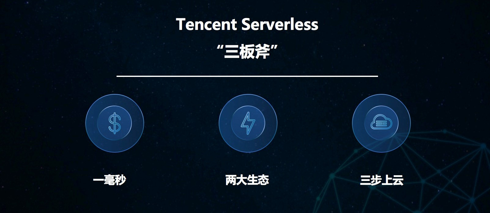
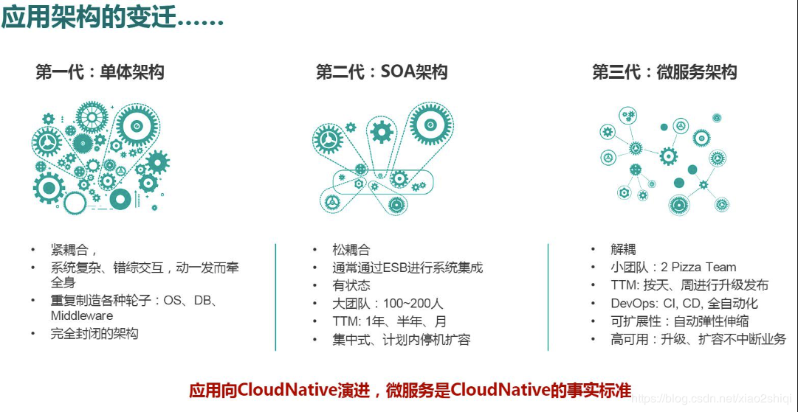
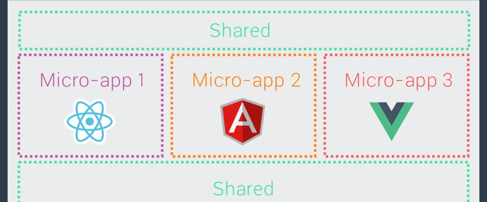

这里记录一周内我看到的值得分享的10条有趣内容（以技术为主），周六发布。

1. [Serverless简介](https://www.cnblogs.com/Bkxk/p/11139928.html)
> Serverless 随着大家的认识提高，加上各大云厂商的推广，逐渐成为IT架构师们在构建系统时考虑的对象。

2. [首推全云端开发体验，腾讯云构建 Serverless 应用新标准](https://news.cnblogs.com/n/657051/)

> 在第三代通用计算平台的探索和布局上，腾讯云已经走在了全球的前列。3 月 6 日，腾讯云正式向外界展示了其在 Serverless 领域的最新进展，包括率先在业界推出 1 毫秒计费模式，并通过进一步打通上下生态链，构建三步上云的极致全云端开发体验。

3. [Serverless + Egg.js 后台管理系统实战](https://china.serverless.com/best-practice/2020-02-07-serverless-admin-system)

> 本文介绍了将一个Egg.js的服务迁移到Serverless架构上

4. [轻松构建基于 Serverless 架构的小程序](https://mp.weixin.qq.com/s/rk6X66tAJz6pZWlgi4ojPQ)

> 此文是介绍在阿里云上构建Serverless架构小程序的。

5. [微服务杂谈](https://mp.weixin.qq.com/s/Jn7kzu6N4EWWtazszRGDAw)

> 微服务相关的文章，多看一下不会有错。

6. [爱奇艺号微前端架构实践](https://mp.weixin.qq.com/s/MgZGuthSv49qXWr_YBhyeQ)

> 微前端架构是一种架构风格类似于微服务的架构，它将微服务的理念应用于浏览器端，即将 Web 应用由单一的单体应用转变为多个小型前端应用聚合为一的应用。由此带来的变化是，这些前端应用可以独立运行、独立开发、独立部署。微前端所具备的便于引入新框架，代码简洁、易维护等特点使其应用愈发广泛。

7. [如何设计一个高可用、高并发秒杀系统](https://mp.weixin.qq.com/s/YfHszSORHP_-W7pJA8PEcg)
> 秒杀抢购基本上是所有商城的必备功能，也是程序员面试经常遇到的问题。针对不同场景有多种方案，此文介绍的方案相对比较完整值得一看。

8. [Python pandas模块21个常用操作可视化](https://mp.weixin.qq.com/s/lsr3EZWPH7RyYcnyIELxWw)

> Pandas 是 Python 的核心数据分析支持库，提供了快速、灵活、明确的数据结构，旨在简单、直观地处理关系型、标记型数据。Pandas 的目标是成为 Python 数据分析实践与实战的必备高级工具，其长远目标是成为最强大、最灵活、可以支持任何语言的开源数据分析工具。经过多年不懈的努力，Pandas 离这个目标已经越来越近了。

9. [“头腾大战”烧至在线办公：微信封禁飞书做错了吗？](https://news.cnblogs.com/n/657057/)

> 最讨厌这种互相封禁的做法，牺牲的永远是用户的利益。不过占在商业的角度和法律的角度，还真不好判断谁对谁错，只能期待国家这方面的法律尽快健全。

10. [独轮车环游地球](https://www.outsideonline.com/2407533/unicycle-travel-gear)

> 第一次看到他的视频是在今日头条上，开始感觉很有趣，后面就感觉做这件是需要多大的毅力难以想象。独轮车不像我们经常骑的自行车，机械上没有任务省力的设计。除了一般人很难驾驭外，骑起来也相当费力。有兴趣可以去今日头条上关注一下他的头条号“环球骑行”。有很多在国内的骑行的视频，还是挺有趣的。

#### 欢迎大家投稿给我，一起把这个周报做好~~
